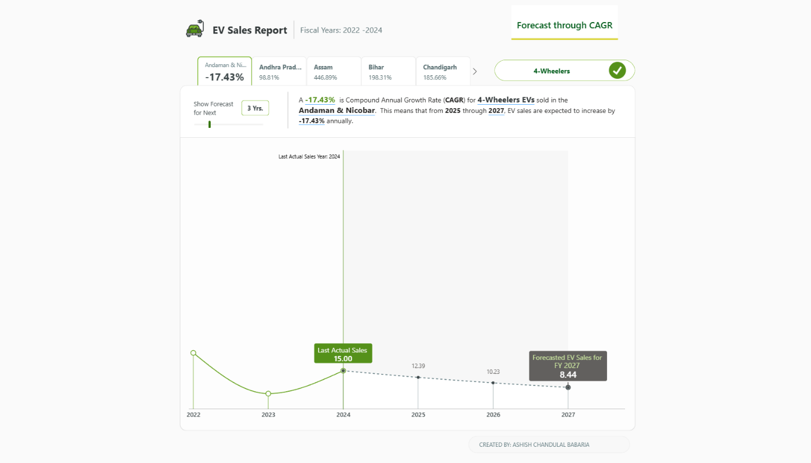
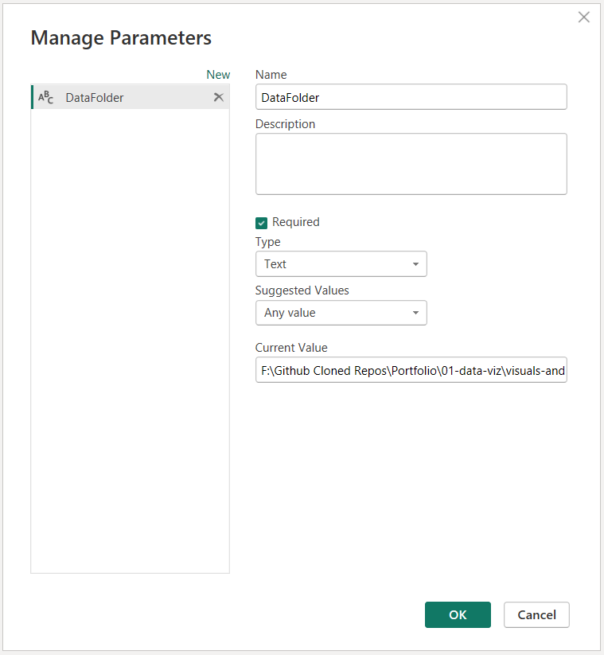

# Forecasting EV Sales with CAGR

An interactive forecast of **electric-vehicle sales across Indian states**, projected
forward with the **Compound Annual Growth Rate (CAGR)**. Pick a state and/or a vehicle
category, choose how many years to forecast, and the chart extends the actual sales curve
into a projected one, recalculating the CAGR and every label as you go.

Built with **native Power BI and DAX** (no custom visual, no Deneb) on the enhanced
native line chart, this project is as much a study in *forecasting logic* as in
DAX-driven visual craft.

[](https://app.powerbi.com/view?r=eyJrIjoiY2Y5YzJhMDctNjE2ZS00YjczLTgyOTYtMmUyMDY3OGJhOWJlIiwidCI6IjQ4ZmE1OWUwLWFiY2UtNGUwOS05NWY4LTgwMmJlZGJkNjZiOCJ9)

> **▶ [Open the live interactive dashboard](https://app.powerbi.com/view?r=eyJrIjoiY2Y5YzJhMDctNjE2ZS00YjczLTgyOTYtMmUyMDY3OGJhOWJlIiwidCI6IjQ4ZmE1OWUwLWFiY2UtNGUwOS05NWY4LTgwMmJlZGJkNjZiOCJ9)** — or click the image above.

---

## The effect

Select a **state**, a **vehicle category** (2-wheeler / 4-wheeler), and a **forecast
horizon**. The chart then:

- draws **actual** EV sales up to the last actual fiscal year,
- extends a **forecast** curve from there to the chosen year,
- prints the **CAGR %** for the current selection (e.g. *124.50% for Manipur, 2-wheelers*),
- labels the **last actual sales** point and the **forecasted end-year** value,
- and rescales the axes and repositions the labels automatically as the numbers change.

Everything responds live to the slicers and the forecast-years selector.

---

## How it works

### The forecast engine

The core projection is a classic CAGR extrapolation:

```
Forecast(year) = LastActualSales * (1 + CAGR) ^ (year - LastActualYear)
```

with CAGR derived from the first and last actual years:

```
CAGR = (LastYearSales / FirstYearSales) ^ (1 / number_of_years) - 1
```

The forward series is generated in a **calculated table** using `GENERATESERIES` to
create the future years and `ADDCOLUMNS` to compute each projected value, then `UNION`ed
with the actual history so a single table holds both.

### The hard part: making a calculated table respond to slicers

Calculated tables are evaluated **once, at data-refresh time** — they can't see a user's
slicer or parameter selections the way a measure can. That's a problem when the forecast
needs to react to **State** and **Vehicle Category** filters.

The solution here is deliberately pragmatic: **four calculated-table variants**, one per
filter combination —

- `EV_Sales_Forecast` (no filter, overall)
- `EV_Sales_Forecast_Only_State_Filter`
- `EV_Sales_Forecast_Only_Vehicle_Category_Filter`
- `EV_Sales_Forecast BOTH Filters`

— paired with **`Dynamic CAGR` measures** that *do* respect filter context. Each dynamic
measure rebuilds a virtual table with `SUMMARIZE` / `SELECTCOLUMNS`, isolates the first
and last actual year for the current selection with `MINX` / `MAXX`, and computes the
CAGR from those. The report switches to the right variant based on what the user has
selected, so the projection always reflects the current slice.

### The stagecraft (DAX as a rendering language)

Most of the ~30 measures aren't calculating the forecast — they build the *experience*
on the native line chart, the same philosophy as a hand-crafted infographic:

- **`Line 1` / `Line 2`** split the series into an **actual** line and a **forecast**
  line so they can be styled differently (solid vs. dashed).
- **`Line 3` / `Line 4`** plot single **endpoint markers** at the last-actual and
  forecasted-end points, with matching **`Datalable`** measures that float the value
  labels beside them.
- **`Line 5`** paints a **shaded reference band** under the forecast region.
- **`Y axis MAX` / `X axis MAX`** are invisible measures that pin the plot area so the
  labels have headroom and the forecast never runs off the edge.
- A **field parameter**, *No. of Forecast Years* (`GENERATESERIES(1, 10, 1)`), lets the
  viewer choose the horizon, feeding the "forecast for N years" logic.

The result: a genuinely analytical forecasting tool that still reads as a clean, simple
chart. The complexity lives in the model; the canvas stays simple.

---

## Open it up

This project ships as **PBIP** (Power BI Project format) — open TMDL, every measure and
calculated table readable as text.

1. Clone or download this folder.
2. Open [`pbip/Forecast through CAGR_RPC12_Electric Vehicle.pbip`](./pbip) in
   **Power BI Desktop** (with the *Power BI Project (.pbip)* preview feature enabled).
3. Set the data source (see **Run it locally** below), then explore the `KPIs` measure
   table and the four `EV_Sales_Forecast*` calculated tables.

---

## Run it locally

The model reads two CSVs from the `data/` folder via a Power Query parameter,
**`DataFolder`**. After cloning:

1. Open the `.pbip` in **Power BI Desktop**.
2. **Home → Transform data → Manage Parameters**.
3. Set **`DataFolder`** to the full path of this project's `data` folder, e.g.
   `...\ev-sales-cagr-forecast\data`
4. **Close & Apply.** The visuals populate and the slicers are live.



The `data/` folder contains:

- `electric_vehicle_sales_by_state.csv`
- `dim_date.csv`

---

## Data & credits

The dataset is from the **Codebasics "Resume Project Challenge" (RPC12)** on electric
vehicle sales in India — a public challenge dataset, credited to
[Codebasics](https://codebasics.io/). This project was originally shared with the
community as a free PBIX; it is republished here as an open, forkable PBIP.

- **Live dashboard:** [Power BI Publish to web](https://app.powerbi.com/view?r=eyJrIjoiY2Y5YzJhMDctNjE2ZS00YjczLTgyOTYtMmUyMDY3OGJhOWJlIiwidCI6IjQ4ZmE1OWUwLWFiY2UtNGUwOS05NWY4LTgwMmJlZGJkNjZiOCJ9)
- **Original reveal (2024):** [LinkedIn post](https://www.linkedin.com/posts/ashishbabaria_dataviz-dataviz-powerbi-ugcPost-7302256114077736961-FtAX)
- **Free PBIX (2024):** [LinkedIn post](https://www.linkedin.com/posts/ashishbabaria_pbicorevisuals-dataviz-activity-7302968253172051968-IPGs)
- **Data:** [Codebasics Resume Project Challenge (RPC12)](https://codebasics.io/)

---

## Author

**Ashish Chandulal Babaria** · [LinkedIn](https://www.linkedin.com/in/ashishbabaria)

Licensed under the [MIT License](../../../LICENSE). Dataset © its original owner
(Codebasics), included for demonstration under the challenge's public-sharing terms.
