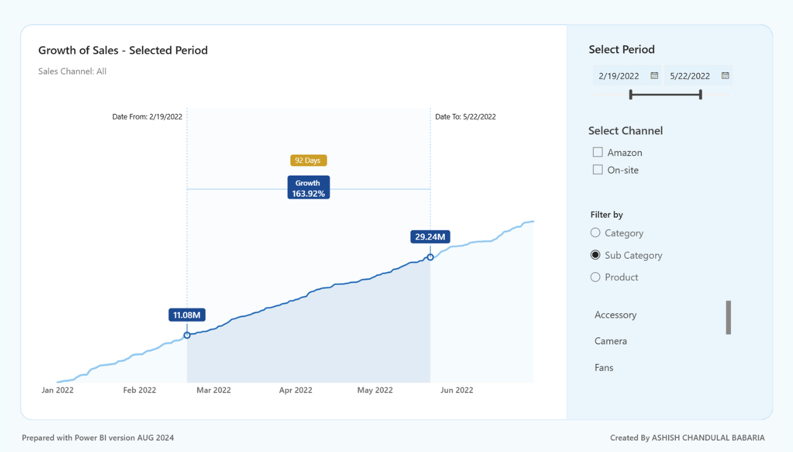

# Sales Growth Between Dates

An interactive **"growth between two dates"** visual for Power BI. Drag a date slider and
everything moves with it — the highlighted period, both endpoint markers, the duration,
and a growth % floating dead-centre between them. All live. All recalculating together.

**No custom visual. No SVG. No HTML.** It is **one native line chart** carrying roughly
seven series, and most of the DAX isn't calculation at all — it's *stagecraft*.

## The effect

Pick a **From** and **To** date on the slider. The chart then:

- shades the selected window between the two dates,
- drops a labelled marker at each endpoint (e.g. `14.30M` → `28.06M`),
- draws vertical lead lines up to the "Date From" / "Date To" captions,
- prints the **duration** (`71 Days`) and the **growth %** (`96.16%`) as pills floated
  exactly halfway across the selected span,
- and updates a dynamic subtitle describing the current channel / category selection.

Everything recomputes the instant the slider moves.

---

## How it works

The trick is that the "chart" is really several measures layered on **one** line-chart
visual, each doing a single job. Broadly, the measures fall into two groups.

### 1. Calculation (the small part)

A handful of measures do actual math: total `Sales`, a running total `Sales RT`
(spined on `ALL(Dim_Date)`), the endpoint values, and
`Growth Sales between dates = DIVIDE(To − From, From)`.

### 2. Stagecraft (the large part)

The majority of the measures render nothing meaningful on their own — they exist purely
to build the experience:

- **Interaction harvesting.** A **disconnected** date table (`Dates disconnected`) feeds
  the slider; `Slicer Selection Min` / `Max` harvest the chosen range and drive the whole
  scene without filtering the fact table directly.
- **Shaded window.** Measures like `Dates Between … BG` return a tall constant **only**
  for dates inside `[Min, Max]`, painting the highlighted band as a plotted area — not a
  shape.
- **Invisible headroom.** A `Y Axis Upper Limit` measure plots an unseen value to force
  the y-axis ceiling higher, so the floating labels have room to breathe.
- **Anchored geometry.** "…on Date From / To" measures return the running total **only**
  on the exact selected endpoint dates (BLANK elsewhere), placing the marker dots; paired
  "…lead line" measures raise the verticals from them.
- **The midpoint trick.** The growth pill and its title are centred over the span by
  synthesising the midpoint date with `DATEDIFF( … ) / 2`, then plotting the label there
  at a fixed height.
- **Text as data.** `Data Label Growth %`, `Data Label Duration` (`"N Days"`), and a
  SWITCH-driven `Filter String` subtitle are all **string measures** used as chart labels.
- **Dynamic dimension.** A **field parameter** (`Param 01: Product`) lets a single axis
  swap Category → Sub-Category → Product.

The net effect: **all the complexity lives in the model; the canvas stays simple, yet
delivers an effective user experience.** Proof that DAX isn't just for calculation — it
can craft an entire experience.

---

## Open it up

This project ships as **PBIP** (Power BI Project format), so the model and report are
plain, readable text.

1. Clone or download this folder.
2. Open [`pbip/Sales Growth Between Dates.pbip`](./pbip) in **Power BI Desktop**
   (a recent version with PBIP enabled).
3. Explore the measures in the **`KPIs`** table — that's where the stagecraft lives.
   The report page geometry is in the `.Report/definition` files.

> **Data note:** the model uses sample/synthetic sales data for demonstration only.

---

## Credits & related work

Originally shared as a free PBIX in 2024, and later featured in a full tutorial by
**Injae Park** — whose breakdown brought it to far more people than I could have alone.

Others explored the same "growth between dates" idea by different methods, and their work
is well worth studying:

- **Injae's tutorial** — https://www.youtube.com/watch?v=jaKUStKW8PA
- **Gustaw Dudek** — https://www.linkedin.com/posts/gustaw-dudek_analytics-data-ux-activity-7066767855563730944-rfnJ
- **Chandeep Chhabra** — https://www.linkedin.com/posts/chandeepchhabra_powerbi-visualization-activity-7073380766499414017-seLJ
- **Greg Philps** (via Deneb) — https://www.linkedin.com/posts/gregphilps_deneb-vegalite-enterprisedna-activity-7083068915412525056-Ns7Q

---

## Author

**Ashish Chandulal Babaria** · [LinkedIn](https://www.linkedin.com/in/ashishbabaria)

Licensed under the [MIT License](../../../LICENSE).
